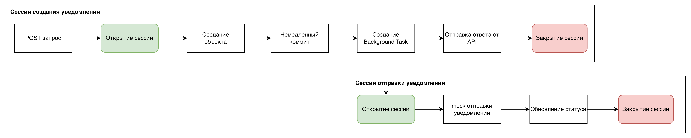
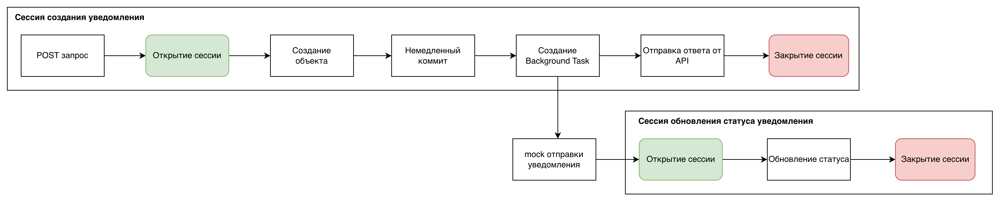

# 

## Сырой набросок на первых этапах
https://gitlab.baretskiy.ru/ozon/ozon_notification_service

## Как запустить проект локально


Я использовал python3.14.2


Склонировать репозиторий

```
git clone https://github.com/alexvilno/notification-service.git
```

Перейти в каталог репозитория

```
cd notification-service
```

Инициализировать venv

```
python3 -m venv .venv
```

Активировать виртуальное окружение

Установить зависимости

```
pip install --upgrade pip && pip install -r requirements.txt
```

Переименовать `.env.example` в `.env`

```javascript
mv .env.example .env
```

Поменять переменные окружения, если это необходимо

Запустить postgres сервис из `docker-compose.yml`

```javascript
docker compose up postgres -d
```

Запустить проект

```javascript
python3 main.py
```

## Как запустить через Docker

Переименовать `.env.example` в `.env`

```javascript
mv .env.example .env
```

Поменять переменные окружения, если это необходимо

Собрать сервис с зависимостями из `docker-compose.yml`

```javascript
docker compose up -d --build
```

## Как запустить тесты

В случае локального развертывания

```javascript
pytest -v
```

В случае развертывания через `docker-compose.yml`

```javascript
 docker compose exec app python -m pytest -v
```

## Краткое описание выбранного задания

## Принятие архитектурных решений

## Сессии

Т.к. для решения задачи явно избыточно использование celery и подобных ему инструментов, я решил использовать BackgroundTasks, встроенные в FastAPI.

[Как оказалось](https://fastapi.tiangolo.com/ru/advanced/advanced-dependencies/?h=%D1%81%D0%B5%D1%81%D1%81%D0%B8%D0%B8#dependencies-with-yield-and-except-technical-details), с версии FastAPI 0.106.0 больше нельзя использовать общие ресурсы с BackgroundTasks, то есть по сути, использовать одну сессию через инъекцию зависимости.

> Если вы полагались на прежнее поведение, теперь ресурсы для фоновых задач следует создавать внутри самой фоновой задачи и использовать внутри неё только данные, которые не зависят от ресурсов зависимостей с `yield`.
>
> \
> Кроме того, фоновая задача обычно — это самостоятельный фрагмент логики, который следует обрабатывать отдельно, со своими ресурсами (например, со своим подключением к базе данных).

### Потенциальные проблемы

Использовать одну сессию и инъецировать её между слоями, означает ждать не только create транзакцию, но и ждать, пока BackgroundTask выполнится до конца, чтобы получить ответ(нарушает условие задачи)

Использовать две разные сессии на каждый сервис, но при этом держать сессию открытой во время исполнения кода, где она в общем то не нужна тоже ошибка, т.к. если RPS будет достаточно велик(как я выяснил с помощью [vegeta](https://github.com/tsenart/vegeta) это порядка 50 запросов в секунду в течение хотя бы 10 секунд), то пулл сессий быстро исчерпается и станет узким горлышком и серьёзной архитектурной проблемой. (пулл сессий дороже, чем асинхронные задачи)

Если честно, я сам сначала допустил эту ошибку

 

Здесь для mock-задачи(которая ждёт 0.2-1 сек) сессия не требуется вообще, значит нет смысла её держать.

### Архитектурное решение

Если коротко - если захватил сессию, нужно постараться её побыстрее закрыть, исполняя только те задачи, где сессия действительно нужна, иначе она дольше не будет освобождена.

Я решил использовать инъекцию зависимости сессии только для repository, т.е. для работы с операциями БД, а для BackgroundTasks открывать новую сессию ТОЛЬКО для операций с БД, потому что нет смысла держать сессию для работы с отправкой уведомлений в сторонний сервис(т.к. сессия будет ждать завершения `asyncio.sleep()`).

 

## Config initialization 

Все параметры должны быть указаны в `.env` файле, обязательными являются только параметры подключения к БД

Описание остальных параметров:

```python
TELEGRAM_SLEEP=<задержка при отправке в секундах>
EMAIL_SLEEP=<задержка при отправке в секундах>
MAX_RETRIES=<максимум retry попыток>
RETRY_DELAY=<задержка между retry попытками>
ERROR_PROBABILITY=<вероятность ошибки>
LOG_LEVEL=<уровень логирования>

APP_HOST=<host приложения>
APP_PORT=<порт приложения>
```

Эти параметры опциональны, по умолчанию инициализируются в соответствии с задачей

## Retry-механизм

Я решил использовать декоратор, потому что можно удобно параметризовать retry механизм для новых хендлеров отправки уведомлений, если нужно будет расширить функционал.

```python
def retry(
        max_attempts: int = 3,
        delay: float = 1.0,
        return_value_on_fail=None
):
    """
    Декоратор для повторных попыток выполнения асинхронной функции
    :param max_attempts: максимальное число попыток
    :param delay: задержка между попытками в секундах
    :param return_value_on_fail: возвращаемое значение
     при исчерпании лимита
    """
```

## Graceful-shutdown

При получении сигналов `SIGINT` и `SIGTERM` uvicorn дожидается завершения фоновых задач.

Остается только закрыть все соединения с БД 

```python
await engine.dispose()
```
